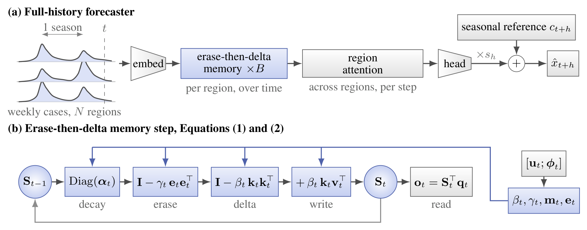

# TERN: A Delta-Rule Memory with a Seasonal Reference and Online Adaptation for Epidemic Forecasting



## About
This repository provides the implementation of **TERN**, as presented in our paper
*"TERN: A Delta-Rule Memory with a Seasonal Reference and Online Adaptation for Epidemic Forecasting"*
(Shunya Nagashima, Neurogica Inc.; Yuta Funayama, LTS, Inc.).

TERN forecasts weekly surveillance counts with an erase-then-delta fast-weight memory whose gates and erase
address are conditioned on local epidemic-phase features, combined with an explicit seasonal reference and online
adaptation. It is evaluated on the Cola-GNN / EpiGNN influenza benchmarks (Japan-Prefectures, US-Regions,
US-States) against epidemic graph models, general time-series forecasters, seasonal references and zero-shot
foundation models under one protocol.

## Getting Started
```bash
git clone git@github.com:Neurogica/TERN.git
cd TERN
uv sync                          # Python 3.10-3.12, PyTorch 2.13
bash scripts/clone_ext_repos.sh  # Time-Series-Library baselines, Cola-GNN data, official EpiGNN code
```

## Data Preparation
`scripts/clone_ext_repos.sh` copies the three influenza datasets released with Cola-GNN into `data/colagnn/`:
`japan.txt` (348 weeks x 47 prefectures), `region785.txt` (785 weeks x 10 HHS regions) and `state360.txt`
(360 weeks x 49 states), together with their adjacency matrices. The loader in `src/data/colagnn.py` reproduces the
EpiGNN protocol: chronological 50/20/30 split, per-region min-max normalisation with training statistics, a 20-week
input window and single-step targets at lead times h in {3, 5, 10, 15}; RMSE and Pearson correlation are pooled over
all test weeks and regions on the count scale.

## Experiments
One run trains one model on one dataset and lead time and writes `results/<dataset>/<tag>/h{h}_s{seed}.json`.

```bash
# window regime: the model reads the 20-week window of the protocol
python src/train.py --dataset japan --horizon 5 --model tern --seed 0 \
    --model_kwargs '{"d_model": 64, "n_layers": 2, "n_heads": 8, "dropout": 0.1, "head": "flatten", "revin": false}' \
    --clip 1.0 --refit_trainval 0.5

# full-history regime: the model reads the entire causal history and forecasts at every step
python src/train.py --dataset japan --horizon 5 --model tern --seed 0 --full_history \
    --model_kwargs '{"d_model": 32, "n_layers": 2, "n_heads": 8, "dropout": 0.5, "season_embedding": true}' \
    --clip 1.0 --scale_weighted_loss --online_blend 12
```

The configurations of the paper are in `config/tern.json` (both regimes, per dataset) and `config/baselines.json`.
`scripts/make_jobs.py` writes them as job files, and `scripts/run_queue.py` runs a job file with several processes
sharing one GPU (finished runs are skipped, so an interrupted queue can be resumed):

```bash
python scripts/make_jobs.py tern      --seeds 0,1,2,3,4 --save_pred   # jobs/tern_window.txt, jobs/tern_full_history.txt
python scripts/make_jobs.py baselines --seeds 0,1,2,3,4 --save_pred   # jobs/baselines.txt
python scripts/make_jobs.py ablation  --seeds 0,1,2                   # jobs/ablation.txt
python scripts/run_queue.py jobs/tern_full_history.txt --parallel 8

python scripts/naive_baselines.py                          # seasonal naive and climatology references
python scripts/run_official.py --dataset japan --horizon 5 # official EpiGNN code under the same protocol
python scripts/zero_shot.py chronos --dataset japan --context full   # needs `uv pip install chronos-forecasting`
python scripts/posthoc_blend.py                            # TERN's online blend applied to the saved baseline forecasts
```

Tables and figures of the paper:

```bash
python scripts/export_tables.py --out tables
python scripts/make_figures.py qualitative --dataset japan --horizon 5 --regions 18,40
python scripts/make_figures.py timescales --tag tern_full
```

## Model options
`--model_kwargs` accepts the constructor arguments of `src/models/tern.py`. The ones used in the paper and its
ablation study are `rule` (`eda`, `delta`, `gdn2`, `gla`), `decay` (`channel`, `scalar`, `none`),
`timescale_init` / `learn_timescale`, `phase_features`, `mixer_type` (`delta`, `attn`), `region_attention`,
`adjacency_bias`, `season_embedding`, and the climatology correction `climatology_seasons`, `climatology_width`,
`climatology_residual`, `residual_scale`. Training-time components are flags of `src/train.py`:
`--scale_weighted_loss`, `--refit_trainval`, `--online_refit`, `--online_blend`, `--ema`.

## Tests
```bash
uv run pytest
```
The tests cover the data protocol, the memory layer (shapes, gate ranges, causality, all rules and decays), the
climatology features, the metrics, the post-hoc blend and a CPU smoke run of both training regimes on synthetic data.
The Time-Series-Library tests are skipped until `scripts/clone_ext_repos.sh` has been run.

## Layout
```
config/           final configurations of TERN and of the baselines
figure/           architecture figure
scripts/          job generation, queue runner, references and baselines, tables and figures
src/train.py      training and evaluation (window and full-history regimes)
src/models/       TERN (tern.py) and the Time-Series-Library wrapper (tslib.py)
src/data/         Cola-GNN protocol loader
src/utils/        metrics
tests/            pytest suite
```

## Acknowledgment
We gratefully acknowledge the following repositories, whose data and code are used for the benchmark and baselines:
- Cola-GNN (https://github.com/amy-deng/colagnn) for the influenza datasets and the evaluation protocol
- EpiGNN (https://github.com/Xiefeng69/EpiGNN)
- Time-Series-Library (https://github.com/thuml/Time-Series-Library)
- The delta-rule linear-attention line of work: DeltaNet, Gated DeltaNet, Kimi Linear, Gated DeltaNet-2 and
  Erase-then-Delta Attention

## Citation
```bibtex
@misc{tern2026,
  author       = {Shunya Nagashima and Yuta Funayama},
  title        = {{TERN}: A Delta-Rule Memory with a Seasonal Reference and Online Adaptation for Epidemic Forecasting},
  year         = {2026},
  howpublished = {\url{https://github.com/Neurogica/TERN}}
}
```

## License
This work is licensed under the BSD-3-Clause-Clear License. To view a copy of this license, see [LICENSE](LICENSE).
